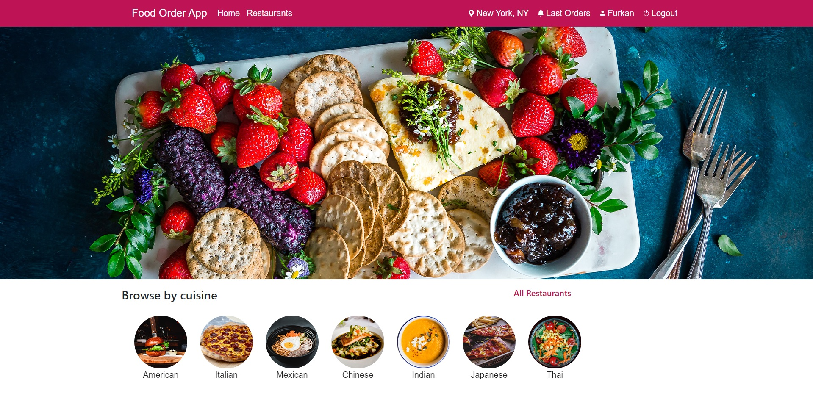
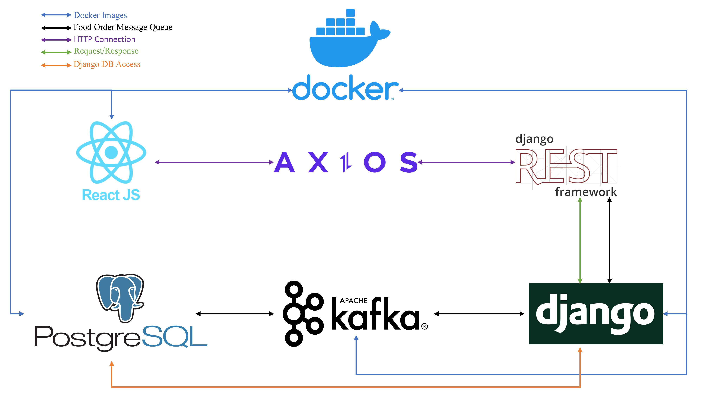
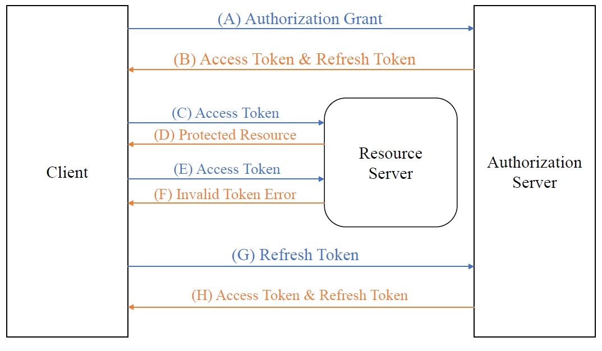

# Food Order Website

## ABOUT
* Front-end: React.JS. Back-end: Django. Rest API: DRF. Message Queue: Apache Kafka. SQL: PostgreSQL.

* Food Order Website with a strong connection between the front-end and back-end. Also, the website has high-security measures for authorization ( OAuth ) to avoid cyber attacks.

* **For more details, please see the photos folder.**

## HOW IT WORKS - Connections


* Axios handles the proxy connection between React.js and Django Rest Framework.
* Kafka stream real-time orders, The front-end admin panel receives data directly from PostgreSQL.

## SECURITY - Authorization


- The Access token will be stored in local storage on the front-end when Refresh tokens store in HTTP Cookies on the back-end.

- Reference: [OAuth Authorization Framework](https://www.rfc-editor.org/rfc/rfc6749)


## Prerequisites
- [Docker](https://docs.docker.com/get-docker/)

## Setup
- Build containers and start services:

```bash
docker-compose up --build
```

- Create a superuser to login into the admin panel:

```bash
docker-compose run --rm backend python manage.py createsuperuser
```

- Detailed commands: [Docker Commands](https://docs.docker.com/engine/reference/commandline/docker/)

## Access Website
 - Frontend: localhost:3000
 - Backend: localhost:8000
